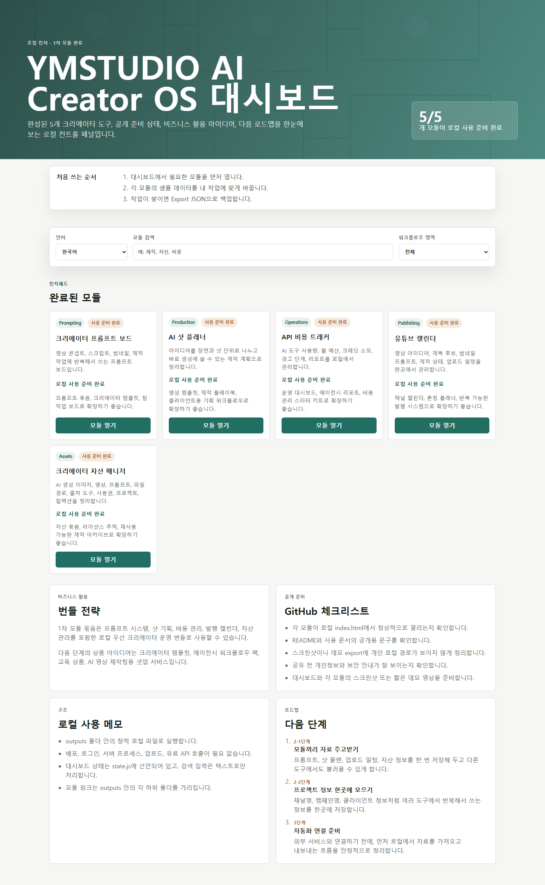

# YMSTUDIO AI Creator OS

Local-first AI Creator OS for prompts, shot planning, API cost tracking, YouTube scheduling, and asset management.

[Live Demo](https://ymstudio-lab.github.io/ymstudio-ai-creator-os/)



YMSTUDIO AI Creator OS is a browser-based MVP bundle for AI video and content creators. It runs as static files, stores data in your browser `localStorage`, and does not require a server, login, upload, or paid API call.

## Modules

| Module | What it helps with |
| --- | --- |
| Creator Prompt Board | Save, search, rate, and reuse creator prompts |
| AI Shot Planner | Plan scenes, shots, generation prompts, and production notes |
| API Cost Tracker | Manually track AI tool usage, credits, budgets, and warnings |
| YouTube Calendar | Manage content ideas, status, upload dates, and weekly plans |
| Creator Asset Manager | Organize generated images, videos, prompts, licenses, and file paths |
| Creator OS Dashboard | Open all modules from one local control panel |

## Quick Start

Use the hosted demo:

```text
https://ymstudio-lab.github.io/ymstudio-ai-creator-os/
```

Or run locally:

1. Download or clone this repository.
2. Open this file in your browser:

```text
outputs/creator-os-dashboard/index.html
```

The root `index.html` also redirects to the dashboard.

## Beginner Flow

1. Open the dashboard.
2. Choose the module you need.
3. Start with the demo data.
4. Replace sample titles, notes, prompts, dates, and tags with your own work.
5. Back up important data with `Export JSON`.

## Data And Privacy

- Data is stored in your browser `localStorage`.
- No account is required.
- No data is uploaded by this app.
- No external API call is made by this app.
- Data is not automatically synced across browsers or devices.

Do not enter API keys, passwords, customer personal data, payment data, or private contract information.

## Status

- Public local MVP
- Static HTML/CSS/JavaScript
- Desktop and mobile screenshot checks passed
- Module tests passed
- No backend, auth, upload, or paid API dependency

## Verification

Run a module test from each module folder:

```powershell
node test.js
```

Run the full screenshot check from this workspace layout:

```powershell
python ..\..\scripts\capture_creator_os_screenshots.py
```

Security pattern scan:

```powershell
rg -n "window\.prompt|fetch\(|XMLHttpRequest|sendBeacon|eval\(|new Function|document\.write|api[_-]?key|secret|password" outputs
```

## Roadmap

- Move data between modules with shared JSON exports
- Add one shared project profile for channel, campaign, and client metadata
- Prepare optional automation adapters after the offline-first workflow is stable

## License

See [LICENSE](LICENSE).
